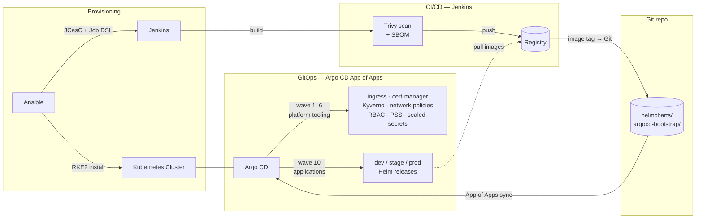

# Kubernetes DevOps Bootstrap

**A config-driven GitOps platform: Ansible → Kubernetes (RKE2) → Argo CD + Jenkins.**  
Clone, fill in `config/defaults.yaml`, and run.

---

## What this is

A reusable template to provision a Kubernetes cluster, install Jenkins for CI/CD, and deploy workloads via **Argo CD** from Git. Every environment-specific value (IPs, ports, namespace names, credential IDs) flows from a single configuration file — no hardcoded values anywhere in the codebase.

Designed as an enterprise-grade starting point for platform engineers adopting GitOps.

---

## Architecture



- **Ansible** provisions nodes with RKE2 (default) and optionally installs Jenkins via JCasC + Job DSL.
- **Argo CD** (App of Apps) syncs from this Git repo in ordered sync waves: platform tooling first (Kyverno engine, cert-manager, network policies, RBAC), then application workloads across dev / stage / prod.
- **Jenkins** builds images, runs Trivy (blocking on CRITICAL/HIGH), generates an SBOM, pushes to the registry, then commits the new image tag to Git — Argo CD detects the change and rolls it out automatically.

---

## Configuration flow

All settings flow from **one file** through the entire stack:

```
config/defaults.yaml
      │
      ├─► Ansible playbooks (vars_files)
      │         └─► Jenkins JCasC template (jenkins.yaml)
      │                   └─► Jenkinsfiles (global env vars — no hardcoded IDs)
      │
      └─► argocd-bootstrap/values.yaml
                └─► Helm charts (system-charts, app-charts)
                          └─► Running workloads
```

Copy `config/defaults.yaml.example` → `config/defaults.yaml`, fill in your values, and everything else inherits from there.

---

## Quick start

**1. Clone and configure**
```bash
git clone https://github.com/YOUR_ORG/k8s-devops-bootstrap.git
cd k8s-devops-bootstrap
cp config/defaults.yaml.example config/defaults.yaml
cp ansible/inventories/dev/hosts.ini.example ansible/inventories/dev/hosts.ini
```
Edit `config/defaults.yaml` — replace every `YOUR_*` / `CHANGE_ME` placeholder.

**2. Prepare secrets**
- Create `ansible/.ansible_vault_pass` (do not commit).
- Encrypt sensitive values with `ansible-vault encrypt_string "VALUE"` and paste into playbook `vars:`.
- See [docs/SECURITY.md](docs/SECURITY.md).

**3. Provision**
```bash
make bootstrap-k8s    # common packages + RKE2 cluster
make install-jenkins  # optional
```

**4. Bootstrap Argo CD**
```bash
make install-argocd
# Script reads config/defaults.yaml automatically:
ARGO_PASS=yourpassword KUBECONFIG=~/.kube/config bash scripts/misc/argocd_prerequisite.sh
```

**5. Push to Git** — Argo CD will sync everything from this repo.

---

## Deployment modes

### Static Applications — simple mode

`argocd-bootstrap/templates/applications/*.yaml` contains one Application manifest per service. This is the default and is easiest to understand. Each file maps a Helm chart to a namespace.

**Use this when:** you have a small, stable set of services.

### ApplicationSet — scale mode

An [Argo CD ApplicationSet](https://argo-cd.readthedocs.io/en/stable/user-guide/application-set/) generates Application objects automatically from a template + a generator (list, cluster, Git directory, etc.). It eliminates the need to write a separate Application manifest for each service or environment.

**Use this when:** you have many services, multiple clusters, or want to onboard new apps by adding a single entry to a list.

Both patterns coexist in this repo. Static Applications are production-ready today. ApplicationSet is opt-in via `applicationset.enabled: true` in `argocd-bootstrap/values.yaml`.

---

## What is core, optional, and demo-only

| Category | Components |
|----------|-----------|
| **Core** | RKE2 cluster provisioning, Argo CD App of Apps, system charts (ingress-nginx, cert-manager, sealed-secrets), default-deny network policies, Kyverno engine + policies, three-tier RBAC, PodDisruptionBudget, dual-metric HPA |
| **Optional** | Jenkins (can swap any CI), GitLab CE, PostgreSQL, MariaDB, kube-prometheus-stack, Loki, phpMyAdmin, ApplicationSet (scale mode); each toolchain is independently toggled via `toolchains.<name>.enabled` |
| **Demo-only** | 5 sample app charts (java-springboot, python-django, laravel-example, payments-example, surge-plugin) — illustrate the deployment pattern; replace with your real services |

---

## Project layout

| Path | Purpose |
|------|---------|
| `config/` | Central config example — single source of truth for all environment values |
| `ansible/` | Playbooks and roles: common packages, RKE2 bootstrap, Jenkins, optional GitLab/DB |
| `helmcharts/` | `helm-common` (library), `system-charts` (platform tooling), `app-charts` (sample services) |
| `argocd-bootstrap/` | Argo CD App of Apps — root Application definitions and Helm values |
| `scripts/` | Jenkinsfiles (CI + CD), Jenkins Job DSL, misc bootstrap scripts |
| `docs/` | Architecture, security, operations, platform design |

---

## Kubernetes provisioner

| Provisioner | Status | Use when |
|-------------|--------|----------|
| **RKE2** | Default (recommended) | All new environments |
| RKE1 | `legacy_compatibility: true` in config | Existing clusters only — RKE1 is upstream EOL |

---

## Security highlights

- All secrets encrypted with **Ansible Vault** — no plaintext in any committed file
- **Sealed Secrets** for Kubernetes secrets in Git (encrypted at rest, safe to commit)
- **Kyverno engine** managed by Argo CD (sync-wave 4), policies applied after (sync-wave 6): blocks privileged containers, enforces non-root, requires probes and resource limits, disallows `:latest` tags
- **Pod Security Standards**: `enforce: restricted` on `prod`, `enforce: baseline` on `dev`/`stage`; `audit/warn: restricted` everywhere
- **Three-tier RBAC**: `platform-admin` (cluster-wide) → `deployer` (namespace write) → `viewer` (namespace read-only)
- **Network policies**: default-deny in all app namespaces; explicit allow-list for DNS and ingress
- **PodDisruptionBudget**: `minAvailable: 1` on every prod chart — zero-downtime node drain
- **Trivy**: container image scans in Jenkins CI (blocking on CRITICAL/HIGH) and config scans in GitHub Actions (advisory)
- **Gitleaks**: secret scanning on every push and PR; `.gitleaks.toml` suppresses confirmed false positives

See [docs/SECURITY.md](docs/SECURITY.md) and [docs/THREAT_MODEL.md](docs/THREAT_MODEL.md).

---

## Contributing

Install pre-commit hooks before your first commit:

```bash
pip install pre-commit
pre-commit install
```

Hooks run automatically: YAML lint, Helm lint, Gitleaks secret scan, file hygiene. See [CONTRIBUTING.md](CONTRIBUTING.md) for the full guide.

Pull requests use the template in `.github/PULL_REQUEST_TEMPLATE.md`. Code ownership is declared in `.github/CODEOWNERS`.

---

## Docs

- [Getting started](docs/GETTING_STARTED.md)
- [Features](docs/FEATURES.md)
- [Architecture](docs/architecture.md)
- [Security](docs/SECURITY.md)
- [Threat model](docs/THREAT_MODEL.md)
- [Observability contract](docs/OBSERVABILITY_CONTRACT.md)
- [Production setup](docs/PRODUCTION_SETUP.md)
- [Platform capabilities](docs/PLATFORM_CAPABILITIES.md)
- [Platform design](docs/PLATFORM_DESIGN.md)
- [Operations](docs/OPERATIONS.md)
- [Deployment policy](docs/DEPLOYMENT_POLICY.md)
- [Versions](docs/VERSIONS.md)

---

## Author

**Sritharan K** — Lead Platform Engineer & Software Architect  
🌐 https://www.skengineer.be

---

## License

See [LICENSE](LICENSE).
