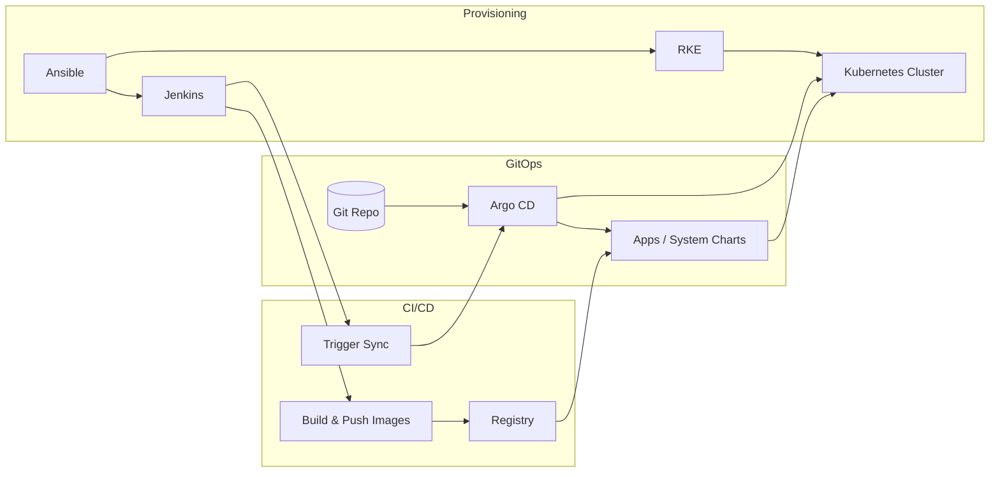

# Kubernetes DevOps Bootstrap

**A config-driven GitOps platform: Ansible → Kubernetes (RKE) → Argo CD + Jenkins.** Clone, set your IPs and URLs in one place, and run.

---

## What this is

A reusable template to provision a Kubernetes cluster with RKE, install Jenkins for CI/CD, and deploy workloads via **Argo CD** from Git. All settings are driven from a single configuration layer—no hardcoded IPs or credentials in code. Suited for platform engineers and teams adopting GitOps.

---

## Architecture



- **Ansible** provisions servers and bootstraps the cluster (and optionally Jenkins, GitLab, DB).
- **Argo CD** syncs applications from this Git repo to the cluster (App of Apps pattern).
- **Jenkins** builds images, pushes to a registry, and can trigger Argo CD to sync.

More detail: [docs/architecture.md](docs/architecture.md).

Design intent (security, GitOps, maturity): [docs/PLATFORM_DESIGN.md](docs/PLATFORM_DESIGN.md).

---

## Prerequisites

- **Ansible** (2.15+ recommended), **kubectl**, **helm**
- SSH key-based access to your server(s)
- Optional: **kubeseal** for sealing secrets; **ansible-vault** for encrypting playbook variables

Install notes: [docs/GETTING_STARTED.md](docs/GETTING_STARTED.md).

---

## Quick start

1. **Clone and configure**
   ```bash
   git clone https://github.com/YOUR_ORG/k8s-devops-bootstrap.git && cd k8s-devops-bootstrap
   ./scripts/bootstrap_config.sh   # optional: copies config/inventory examples and prints next steps
   # Or manually:
   cp config/defaults.yaml.example config/defaults.yaml
   cp ansible/inventories/dev/hosts.ini.example ansible/inventories/dev/hosts.ini
   ```
   Edit `config/defaults.yaml` and `ansible/inventories/dev/hosts.ini`: set `YOUR_MASTER_IP`, `YOUR_WORKER_IP`, `YOUR_SSH_USER`, Git repo URL, and any other placeholders.

2. **Prepare secrets**
   - Create `ansible/.ansible_vault_pass` with your vault password (do not commit). Encrypt playbook variables (e.g. `ansible_user`, `jenkins_git_password`) with `ansible-vault encrypt_string "VALUE"`.
   - See [docs/SECURITY.md](docs/SECURITY.md) for what must never be committed and how to generate sealed secrets.

3. **Provision cluster and Jenkins**
   ```bash
   make bootstrap-k8s    # install common packages + RKE bootstrap
   make install-jenkins  # install Jenkins (optional)
   ```
   Use your kubeconfig (e.g. `ansible/data/kube_config_cluster.yaml`) and set `KUBECONFIG` for the next steps.

4. **Install Argo CD and seal secrets**
   ```bash
   make install-argocd
   # After sealed-secrets controller is running:
   make seal-secrets
   ```
   Bootstrap the Argo CD app-of-apps using the script in `scripts/misc/argocd_prerequisite.sh` (set `ARGO_URL`, `KUBECONFIG_PATH`, `GIT_REPO` from your config).

5. **Push your config to Git** so Argo CD can sync. Only sealed secrets and placeholder manifests should be committed—see [docs/SECURITY.md](docs/SECURITY.md).

---

## Configuration

All settings live in one place:

| What to set | Where |
|-------------|--------|
| Cluster IPs, SSH user, ports | `config/defaults.yaml` and `ansible/inventories/dev/hosts.ini` |
| Git repo URL (this repo or fork) | `config/defaults.yaml` → Argo CD bootstrap script and playbooks |
| Argo CD URL, admin password | `config/defaults.yaml`; Argo CD Helm values in `helmcharts/system-charts/argo-cd/values-lab.yaml` (lab) or `values-production.yaml` (production, Ingress+TLS only) |
| Docker registry, Helm chart repo | `config/defaults.yaml`; unseal secret templates under `helmcharts/system-charts/argocd-config/unseal/` |

Copy `config/defaults.yaml.example` to `config/defaults.yaml` and replace every `YOUR_*` placeholder. Do not commit `config/defaults.yaml` if it contains real credentials.

---

## Project layout

| Path | Purpose |
|------|---------|
| `ansible/` | Playbooks and roles: common packages, RKE bootstrap, Jenkins, optional GitLab/DB |
| `helmcharts/` | `helm-common`, `system-charts` (Argo CD, ingress, cert-manager, sealed-secrets, …), `app-charts` |
| `argocd-bootstrap/` | Argo CD App of Apps definitions (GitOps source) |
| `scripts/` | Jenkinsfiles, Jenkins Job DSL, misc (Argo CD bootstrap script, seal-secrets) |
| `config/` | Central config example; copy and fill for your environment |
| `docs/` | Architecture, getting started, security, production setup, operations |

---

## Optional components

The following are **optional** and not tested in every combination:

- **GitLab CE** (Step 0 in the detailed guide)
- **PostgreSQL / MariaDB** (Step 4)
- **Extra system charts** (e.g. kube-prometheus-stack, Loki, phpMyAdmin)

You can enable or skip them via playbook roles and Argo CD; see the detailed steps in [docs/GETTING_STARTED.md](docs/GETTING_STARTED.md).

**ApplicationSet (optional):** If you add many apps or multiple environments, consider [Argo CD ApplicationSet](https://argo-cd.readthedocs.io/en/stable/user-guide/application-set/) to generate Applications from a template (e.g. list generator for namespaces or cluster generator). The repo currently uses static Application manifests under `argocd-bootstrap/templates/`; an ApplicationSet Controller can be installed alongside Argo CD and a generator template added when you need it.

---

## Security and sanitization

- **Never commit:** vault password, kubeconfig, RKE state file, or unsealed secrets. See [docs/SECURITY.md](docs/SECURITY.md).
- **Sealed secrets:** generate unsealed manifests locally, run `make seal-secrets`, commit only the sealed YAML.

---

## Docs

- [Getting started](docs/GETTING_STARTED.md) (detailed steps)
- [**Full features and flow**](docs/FEATURES.md) (code-based feature list and diagram)
- [Architecture](docs/architecture.md)
- [Security & sanitization](docs/SECURITY.md) (what not to commit, sealed secrets, Trivy policy)
- [Threat model](docs/THREAT_MODEL.md) (risk → mitigation, policy rejection example)
- [Observability contract](docs/OBSERVABILITY_CONTRACT.md) (health, readiness/liveness, optional metrics)
- [Production setup](docs/PRODUCTION_SETUP.md) (config, secrets, Argo CD, RBAC, quotas)
- [Platform capabilities](docs/PLATFORM_CAPABILITIES.md) (controls, threat model — summary)
- [Platform design](docs/PLATFORM_DESIGN.md) (architect intent: security, GitOps, maturity)
- [Operations](docs/OPERATIONS.md) (RKE EOL, backup, audit)
- [Argo CD SSO](docs/ARGOCD_SSO.md) (optional OIDC/OAuth)
- [Deployment policy](docs/DEPLOYMENT_POLICY.md) (image tags, CD via Git)
- [Versions](docs/VERSIONS.md) (component versions)

---

## Versions

Validated at publish time. See [docs/VERSIONS.md](docs/VERSIONS.md) for where each component version is defined (Ansible defaults, Chart.yaml, sample Dockerfiles). Updates welcome via PR.

---

## Author

**Sritharan K**  
Lead Platform Engineer & Software Architect  
🌐 https://www.skengineer.be

---

## License

See [LICENSE](LICENSE) in the repository root.
