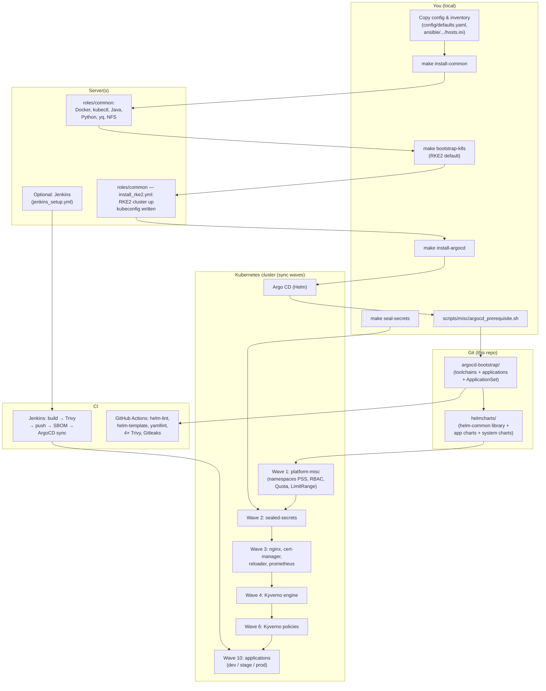

# Full feature list and flow (code-based)

This document lists all features of the project and describes the end-to-end flow with references to the actual code paths.

---

## 1. Feature overview

| Area | Feature | Where in code |
|------|---------|----------------|
| **Provisioning** | Install common packages (Docker, kubectl, Java, Python, yq, NFS, optional ArgoCD CLI, PHP tools) | `ansible/playbooks/install_common.yml` → `ansible/roles/common/` |
| **Provisioning** | Bootstrap Kubernetes with **RKE2** (recommended) — installs via official script, writes config, starts systemd service | `ansible/roles/common/tasks/install_rke2.yml`; template `rke2-config.yaml.j2` |
| **Provisioning** | Bootstrap Kubernetes with RKE1 (legacy compatibility) | `ansible/roles/common/tasks/install_rke.yml` |
| **Provisioning** | Install and configure Jenkins (JCasC, Job DSL, plugins) | `ansible/playbooks/jenkins_setup.yml` → `ansible/roles/install_jenkins/` |
| **Provisioning** | Optional: GitLab CE | `ansible/playbooks/gitlab_setup.yml` → `ansible/roles/install_gitlab_server/` |
| **Provisioning** | Optional: PostgreSQL or MariaDB | `ansible/playbooks/install_database.yml` → roles `install_postgresql` / `install_mariadb` |
| **Configuration** | Single config file — IPs, URLs, namespaces, registry, RBAC groups, quotas | `config/defaults.yaml.example` (copy to `config/defaults.yaml`) |
| **Configuration** | Ansible inventory | `ansible/inventories/dev/hosts.ini.example` |
| **GitOps** | Argo CD install (Helm) | `Makefile` target `install-argocd` → `helmcharts/system-charts/argo-cd/` |
| **GitOps** | App-of-Apps bootstrap | `scripts/misc/argocd_prerequisite.sh` |
| **GitOps** | Toolchain Applications (ingress-nginx, cert-manager, sealed-secrets, NFS, Kyverno engine, Kyverno policies, network-policies, misc, argocd-project) — each with `enabled: true/false` flag | `argocd-bootstrap/templates/toolchains/*.yaml`; flags in `argocd-bootstrap/values.yaml` under `toolchains.*` |
| **GitOps** | Sync-wave ordering: platform (1) → sealed-secrets (2) → reloader/prometheus (3) → Kyverno engine (4) → Kyverno policies (6) → apps (10) | `argocd.argoproj.io/sync-wave` annotations |
| **GitOps** | Static Applications for **all three environments** (dev, stage, prod) — complete `dev → stage → prod` GitOps chain | `argocd-bootstrap/templates/applications/dev/`, `stage/`, `*.yaml` (prod) |
| **GitOps** | **ApplicationSet** — scale-mode alternative; one object generates all 15 Applications (5 apps × 3 envs); opt-in via `applicationSet.enabled: true` | `argocd-bootstrap/templates/applicationsets/app-charts.yaml` |
| **Secrets** | Sealed Secrets — seal manifests with kubeseal | `scripts/misc/seal_k8s_secrets.sh` |
| **Secrets** | Example secret templates (docker-registry, argocd-repo, jenkins credentials, DB credentials) | `argocd-config/templates/*.yaml.example` |
| **CI/CD** | Jenkins pipelines: build → Trivy image scan (blocking CRITICAL/HIGH) → push → SBOM (Syft/CycloneDX) → ArgoCD sync | `scripts/jenkinsfiles/ci/*.Jenkinsfile`, `scripts/jenkinsfiles/cd/*.Jenkinsfile` |
| **CI/CD** | GitHub Actions — 8 jobs: Helm lint, Helm template, YAML lint, 4× Trivy config scans (advisory), Gitleaks; manual `workflow_dispatch` trigger | `.github/workflows/validate.yml` |
| **Security** | Pod Security Standards — `enforce: restricted` on prod, `enforce: baseline` on dev/stage; `audit/warn: restricted` everywhere | `helmcharts/system-charts/00_misc/templates/namespaces-pss.yaml`; per-namespace config in `values.yaml` under `namespacePss` |
| **Security** | Default-deny NetworkPolicies + allow-lists (DNS, ingress, intra-namespace) | `helmcharts/system-charts/network-policies/` |
| **Security** | Three-tier RBAC: `platform-admin` (ClusterRole, full control) → `deployer` (Role/ns, CI/CD write) → `viewer` (Role/ns, read-only) | `helmcharts/system-charts/00_misc/templates/platform-admin-rbac.yaml`, `app-namespace-role-deployer.yaml`, `app-namespace-role-viewer.yaml` |
| **Security** | ArgoCD AppProject with minimal `clusterResourceWhitelist` | `helmcharts/system-charts/argocd-project/` |
| **Security** | Kyverno engine (admission controller) — managed by ArgoCD at sync-wave 4 | `helmcharts/system-charts/kyverno/`; `argocd-bootstrap/templates/toolchains/kyverno.yaml` |
| **Security** | Kyverno ClusterPolicies (sync-wave 6): block-privileged, disallow-latest-tag, require-readiness-probe, require-resource-limits, require-run-as-non-root | `helmcharts/system-charts/kyverno-policies/templates/` |
| **Security** | ResourceQuota + LimitRange per namespace (prod/stage/dev sized differently) | `helmcharts/system-charts/00_misc/templates/limitrange-resourcequota.yaml` |
| **Security** | Gitleaks false-positive suppression via `.gitleaks.toml` | `.gitleaks.toml` |
| **Apps** | Shared Helm library chart (deployment, service, ingress, HPA, PDB, PVC, securityContext, probes, env, configMap, resources) | `helmcharts/helm-common/` |
| **Apps** | **PodDisruptionBudget** — `minAvailable: 1` enabled on all prod charts | `helmcharts/helm-common/templates/pdb.yaml`; `values-prod.yaml` under `pdb` |
| **Apps** | **HPA dual-metric** — `targetCPUUtilizationPercentage: 70` + `targetMemoryUtilizationPercentage: 80` on all prod charts | `helmcharts/app-charts/*/values-prod.yaml` under `autoscaling` |
| **Apps** | Per-environment values (dev / stage / prod) with correct probes, resource limits, and DB hosts | `helmcharts/app-charts/<app>/values-*.yaml` |
| **Apps** | Commented ingress block in every `values-prod.yaml` — NGINX + cert-manager TLS wiring ready to uncomment | `helmcharts/app-charts/*/values-prod.yaml` |
| **Apps** | Commented Prometheus scrape annotations in every `values-prod.yaml` — port pre-filled per app | `helmcharts/app-charts/*/values-prod.yaml` under `podAnnotations` |
| **Samples** | Sample services with Dockerfiles, `docker-compose.yml`, and `.env.example` for all 5 apps | `sample-services/` |
| **Developer UX** | `make help` — self-documenting Makefile prints all targets and variables | `Makefile` |
| **Developer UX** | `make helm-deps` — resolves dependencies for app charts **and** kyverno system chart | `Makefile` |
| **Developer UX** | Pre-commit hooks: file hygiene, yamllint, gitleaks, helm lint | `.pre-commit-config.yaml` |
| **Developer UX** | PR template — What / Why / Type / Risk / Test plan shown on every new PR | `.github/PULL_REQUEST_TEMPLATE.md` |
| **Developer UX** | CODEOWNERS — auto-assigns `@SritharanK` as reviewer on all paths | `.github/CODEOWNERS` |

---

## 2. End-to-end flow (code-based)

**In words:**

1. Copy `config/defaults.yaml.example` → `config/defaults.yaml` and `hosts.ini.example` → `hosts.ini`. Set IPs, namespaces, RBAC groups, registry.
2. `make install-common` → installs Docker, kubectl, Java, Python, yq, NFS on hosts.
3. `make bootstrap-k8s` → runs `install_rke2.yml` (default), bringing up the RKE2 cluster.
4. Optionally `make install-jenkins` → installs Jenkins with JCasC.
5. `make install-argocd` → installs Argo CD via Helm.
6. `argocd_prerequisite.sh` → creates namespaces, registers the Git repo, creates the root Application.
7. Argo CD syncs `argocd-bootstrap/` in wave order: platform objects → sealed-secrets → networking → Kyverno engine → Kyverno policies → app workloads.
8. Jenkins (if installed) builds images, runs Trivy (blocking), generates SBOM, pushes, and triggers ArgoCD sync.

---

## 3. Where to start (by role)

| If you want to… | Start here |
|-----------------|------------|
| Configure IPs, namespaces, RBAC | `config/defaults.yaml.example` → `config/defaults.yaml` |
| Provision the cluster | `Makefile` (`install-common`, `bootstrap-k8s`); `ansible/playbooks/` |
| Bootstrap GitOps | `make install-argocd`; then `scripts/misc/argocd_prerequisite.sh` |
| Enable/disable a toolchain | `argocd-bootstrap/values.yaml` → `toolchains.<name>.enabled` |
| Add a new application | Add an entry to `helmcharts/app-charts/`, create values files, add Application YAMLs under `argocd-bootstrap/templates/applications/` or extend `applicationSet.apps[]` |
| Scale to many apps | Set `applicationSet.enabled: true` in `argocd-bootstrap/values.yaml` |
| Seal secrets | `scripts/misc/seal_k8s_secrets.sh`; templates in `argocd-config/templates/` |
| Add a CI pipeline | `scripts/jenkinsfiles/ci/` and `scripts/jenkinsfiles/cd/` |
| Set up local dev hooks | `pip install pre-commit && pre-commit install` (see `CONTRIBUTING.md`) |
| Understand security controls | [SECURITY.md](SECURITY.md), [PLATFORM_CAPABILITIES.md](PLATFORM_CAPABILITIES.md), [THREAT_MODEL.md](THREAT_MODEL.md) |

---

## 4. Related docs

- [Architecture](architecture.md) — High-level overview.
- [Getting started](GETTING_STARTED.md) — Step-by-step setup.
- [Production setup](PRODUCTION_SETUP.md) — Production checklist.
- [Platform capabilities](PLATFORM_CAPABILITIES.md) — Controls and enforcement matrix.
- [Threat model](THREAT_MODEL.md) — Risk → mitigation, policy rejection examples.
- [Observability contract](OBSERVABILITY_CONTRACT.md) — Health probes and metrics.
- [Security](SECURITY.md) — What not to commit; Jenkins (blocking) vs GitHub Actions (advisory).
- [Versions](VERSIONS.md) — Component versions.
