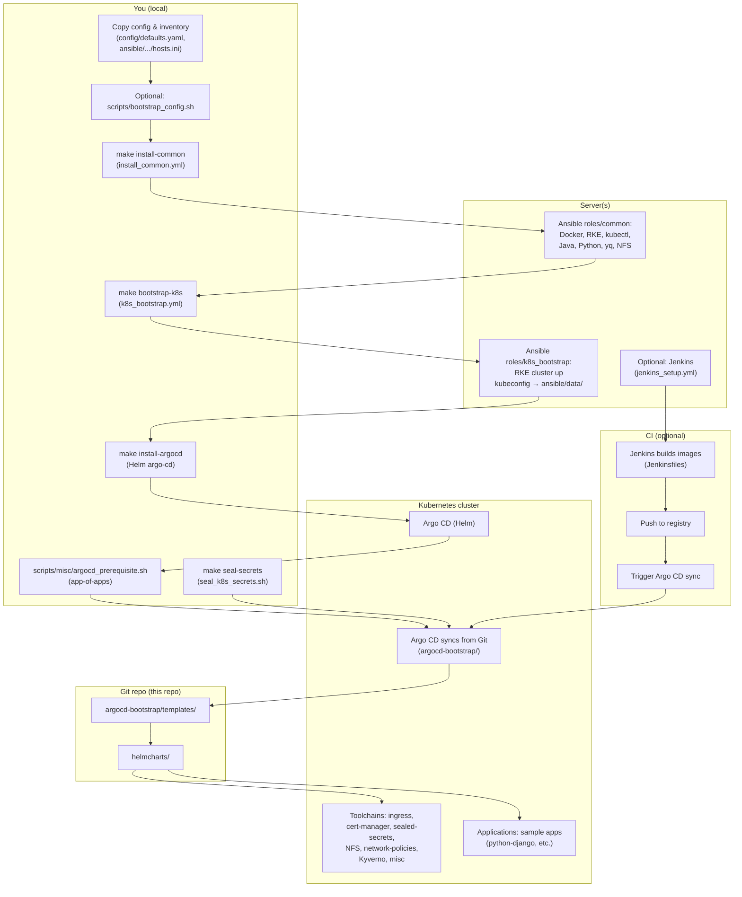

# Full feature list and flow (code-based)

This document lists all features of the project and describes the end-to-end flow with references to the actual code paths. Use it to understand what the platform does and where each part lives.

---

## 1. Feature overview

| Area | Feature | Where in code |
|------|---------|----------------|
| **Provisioning** | Install common packages (Docker, RKE, kubectl, Java, Python, yq, NFS, optional Argo CD CLI, PHP tools) | `ansible/playbooks/install_common.yml` → `ansible/roles/common/` |
| **Provisioning** | Bootstrap Kubernetes cluster with RKE | `ansible/playbooks/k8s_bootstrap.yml` → `ansible/roles/k8s_bootstrap/` |
| **Provisioning** | Install and configure Jenkins (JCasC, Job DSL, plugins) | `ansible/playbooks/jenkins_setup.yml` → `ansible/roles/install_jenkins/` |
| **Provisioning** | Optional: GitLab CE | `ansible/playbooks/gitlab_setup.yml` → `ansible/roles/install_gitlab_server/` |
| **Provisioning** | Optional: PostgreSQL or MariaDB | `ansible/playbooks/install_database.yml` → `ansible/roles/install_postgresql/` or `install_mariadb/` |
| **Configuration** | Single config file for IPs, URLs, registry, Argo CD | `config/defaults.yaml.example` (copy to `config/defaults.yaml`) |
| **Configuration** | Ansible inventory (hosts) | `ansible/inventories/dev/hosts.ini.example` (copy to `hosts.ini`) |
| **GitOps** | Argo CD install (Helm) | `Makefile` target `install-argocd` → `helmcharts/system-charts/argo-cd/` |
| **GitOps** | App-of-Apps bootstrap (root Application) | `scripts/misc/argocd_prerequisite.sh` |
| **GitOps** | System components: ingress-nginx, cert-manager, sealed-secrets, NFS provisioner, Argo CD project, config, network policies, Kyverno policies, misc (namespaces, RBAC, LimitRange, etc.) | `argocd-bootstrap/templates/toolchains/*.yaml` |
| **GitOps** | Sample applications: python-django, java-springboot, laravel-example, surge-plugin, foggypay | `argocd-bootstrap/templates/applications/*.yaml` |
| **Secrets** | Sealed Secrets: seal unsealed YAML with kubeseal | `scripts/misc/seal_k8s_secrets.sh` |
| **Secrets** | Docker registry pull secret (create + seal) | `scripts/misc/create_k8s_docker_secret_seal.sh`; templates in `helmcharts/system-charts/argocd-config/unseal/` |
| **CI/CD** | Jenkins pipelines: build, test, Trivy image scan (blocking on CRITICAL/HIGH), push image, trigger Argo CD sync | `scripts/jenkinsfiles/ci/*.Jenkinsfile` and `scripts/jenkinsfiles/cd/*.Jenkinsfile` |
| **CI/CD** | GitHub Actions: Helm template, Trivy config scan (advisory), Gitleaks | `.github/workflows/validate.yml`; see [SECURITY.md](SECURITY.md#trivy-vulnerability-and-config-scanning) for enforcement vs advisory |
| **Security** | Pod Security Standards (PSS) on namespaces | `helmcharts/system-charts/00_misc/namespaces-pss.yaml` |
| **Security** | Default-deny network policies + allow DNS/ingress | `helmcharts/system-charts/network-policies/` |
| **Security** | Platform admin RBAC | `helmcharts/system-charts/00_misc/platform-admin-rbac.yaml` |
| **Security** | Argo CD AppProject (restrict destination namespaces) | `helmcharts/system-charts/argocd-project/prod.yml` |
| **Security** | Kyverno (when installed): block privileged, require resource limits, runAsNonRoot, readinessProbe | `helmcharts/system-charts/kyverno-policies/*.yaml` |
| **Security** | LimitRange and ResourceQuota per namespace | `helmcharts/system-charts/00_misc/limitrange-resourcequota.yaml` |
| **Apps** | Shared Helm chart (securityContext, probes, env, configMap, resources) | `helmcharts/helm-common/` |
| **Apps** | App charts with prod values (resources, probes) compliant with Kyverno | `helmcharts/app-charts/*/values-prod.yaml` |
| **Apps** | App charts (python-django, java-springboot, laravel, foggypay, surge-plugin) | `helmcharts/app-charts/*/` |
| **Apps** | Per-environment values: **values-prod.yaml** (used by Argo CD; includes resources for Kyverno), **values-dev.yaml** | `helmcharts/app-charts/<app>/values-*.yaml` |
| **Samples** | Sample services (Dockerfiles, source) | `sample-services/` |
| **Entrypoints** | One-command bootstrap (config + inventory copy + next steps) | `scripts/bootstrap_config.sh` |
| **Entrypoints** | Make targets: install-common, bootstrap-k8s, install-jenkins, install-argocd, seal-secrets | `Makefile` |

---

## 2. End-to-end flow (code-based)

The diagram below shows the flow as implemented in this repo. Each step maps to files or commands you run.

**In words:**

1. **You** copy `config/defaults.yaml.example` → `config/defaults.yaml` and `hosts.ini.example` → `hosts.ini` (or run `scripts/bootstrap_config.sh`). You set IPs, URLs, and secrets (vault, sealed secrets).
2. **make install-common** runs `ansible/playbooks/install_common.yml`, which uses **roles/common** to install Docker, RKE, kubectl, Java, Python, yq, NFS, etc. on the hosts defined in inventory.
3. **make bootstrap-k8s** runs `ansible/playbooks/k8s_bootstrap.yml`, which uses **roles/k8s_bootstrap** to create the RKE cluster and write kubeconfig to `ansible/data/`.
4. Optionally **make install-jenkins** runs `jenkins_setup.yml` to install Jenkins on the server.
5. **make install-argocd** installs Argo CD via Helm from `helmcharts/system-charts/argo-cd/` (using `values-lab.yaml` or `values-production.yaml`).
6. **scripts/misc/argocd_prerequisite.sh** creates namespaces, logs into Argo CD, adds the Git repo, and creates the root Application **argocd-bootstraper** that points at the `argocd-bootstrap/` path in Git.
7. Argo CD syncs **argocd-bootstrap/templates/** (toolchains + applications). Toolchains deploy system components (ingress, cert-manager, sealed-secrets, NFS, network policies, Kyverno, misc). Applications deploy sample apps from **helmcharts/app-charts/**.
8. **make seal-secrets** (or the Docker secret script) seals secrets in `argocd-config/unseal/` and writes them to `argocd-config/sealed/`; only sealed YAML is committed.
9. **Jenkins** (if installed) runs pipelines in `scripts/jenkinsfiles/ci/` and `scripts/jenkinsfiles/cd/`: build, Trivy scan, push image, trigger Argo CD sync so new images are deployed via GitOps.

---

## 3. Where to start (by role)

| If you want to… | Start here |
|-----------------|------------|
| Configure IPs and URLs | `config/defaults.yaml.example` → `config/defaults.yaml`; `ansible/inventories/dev/hosts.ini.example` → `hosts.ini` |
| Provision the cluster | `Makefile` (`install-common`, `bootstrap-k8s`); playbooks in `ansible/playbooks/` |
| Install Argo CD and bootstrap GitOps | `make install-argocd`; then `scripts/misc/argocd_prerequisite.sh` |
| Add or change system components | `argocd-bootstrap/templates/toolchains/` and Helm charts in `helmcharts/system-charts/` |
| Add or change an application | `argocd-bootstrap/templates/applications/` and `helmcharts/app-charts/` |
| Seal secrets | `scripts/misc/seal_k8s_secrets.sh`; unseal templates in `helmcharts/system-charts/argocd-config/unseal/` |
| Add a CI pipeline | `scripts/jenkinsfiles/ci/` and `scripts/jenkinsfiles/cd/`; Jenkins Job DSL in `ansible/roles/install_jenkins/` |
| Understand security controls | [PLATFORM_CAPABILITIES.md](PLATFORM_CAPABILITIES.md) (enforcement matrix); [THREAT_MODEL.md](THREAT_MODEL.md) (risk → mitigation, policy rejection demo); [OBSERVABILITY_CONTRACT.md](OBSERVABILITY_CONTRACT.md); `helmcharts/system-charts/00_misc/`, `network-policies/`, `kyverno-policies/` |

---

## 4. Related docs

- [Architecture](architecture.md) — High-level overview and diagram.
- [Getting started](GETTING_STARTED.md) — Step-by-step setup.
- [Production setup](PRODUCTION_SETUP.md) — Checklist for production.
- [Platform capabilities](PLATFORM_CAPABILITIES.md) — Controls, enforcement matrix, threat overview.
- [Threat model](THREAT_MODEL.md) — Risk → mitigation, policy rejection examples.
- [Observability contract](OBSERVABILITY_CONTRACT.md) — Health/probes and optional metrics.
- [Security & Trivy policy](SECURITY.md) — What not to commit; Jenkins (blocking) vs GitHub Actions (advisory).
- [Versions](VERSIONS.md) — Component versions.
