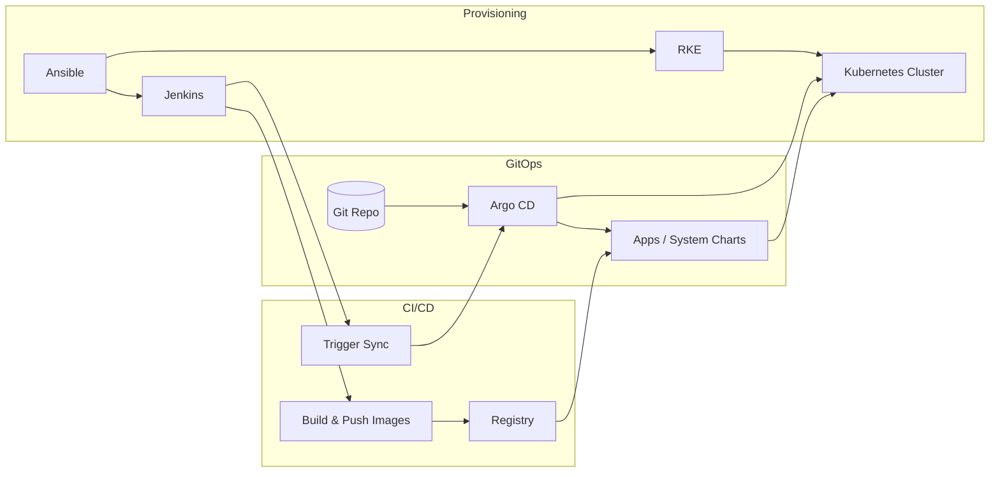

# Architecture

This document gives a one-page overview of how the platform is structured and how components interact.

---

## High-level flow

1. **Ansible** provisions servers and installs common tooling (Docker, RKE, kubectl, Java, Python, etc.), then bootstraps a **Kubernetes cluster** with RKE. Optionally it installs **Jenkins**, **GitLab CE**, and/or **PostgreSQL/MariaDB** on the same or other hosts.
2. **Argo CD** is installed on the cluster via Helm and uses a **GitOps** model: it syncs applications from a Git repository (this repo or your fork). The **App of Apps** pattern deploys system components (ingress, cert-manager, sealed-secrets, NFS provisioner, etc.) and application Helm charts.
3. **Jenkins** runs CI/CD pipelines: it builds container images, pushes them to a registry, and can trigger Argo CD to sync. Application definitions and Helm values live in Git; Argo CD applies them to the cluster.

---

## Diagram

**In words:**

- **Ansible** → installs RKE and bootstraps **Kubernetes cluster**; optionally installs **Jenkins** (and GitLab/DB).
- **Git repo** → holds Helm charts and Argo CD application definitions; **Argo CD** syncs them to the cluster (GitOps).
- **Jenkins** → builds images, pushes to a **registry**; can trigger Argo CD to sync so new images are deployed.

---

## Single-node vs multi-node

You can run everything on **one server** by assigning the same IP to the Ansible groups (masters, workers, jenkins, etc.). For production or higher availability, use separate hosts for masters, workers, and Jenkins and point the inventory and config at the appropriate IPs.

---

## Optional components

GitLab CE, PostgreSQL, MariaDB, and some system charts (e.g. kube-prometheus-stack, Loki, phpMyAdmin) are **optional**. They are included as reference; not every combination is tested. See the README and playbooks for enable/disable options.
